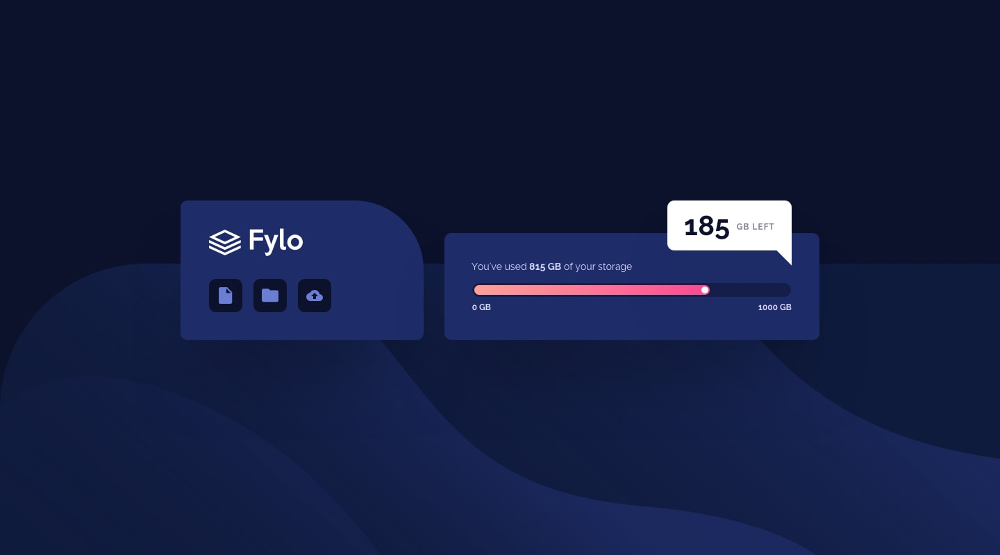

# Fylo Data Storage Component

## Description
This project is a responsive web page built for the **Fylo Data Storage Component** challenge from [Frontend Mentor](https://www.frontendmentor.io/). It showcases a sleek, modern design for displaying storage usage with interactive elements, optimized for both desktop and mobile devices.

## Features
- **Responsive Design**: Fully optimized for various screen sizes, including desktop, tablet, and mobile.
- **Interactive UI**: Visual representation of storage usage with a progress bar.
- **Clean Code**: Follows best practices for HTML and CSS.

## Technologies Used
- **HTML5**
- **CSS3**

## How to Run the Project
1. Clone the repository:
   ```bash
   git clone <repository-url>
   ```
2. Open the project folder.
3. Open the `index.html` file in your browser to view the project.

## File Structure
```
project-folder/
│
├── index.html         # Main HTML file
├── style.css          # CSS styles
├── images/            # Assets used in the project
│   ├── logo.svg       
│   ├── bg-desktop.png
│   ├── bg-mobile.png  
│   ├── icon-document.svg
│   ├── icon-folder.svg
│   └── icon-upload.svg
```

## Screenshots

## Live Site URL
Visit the live project here: [Live Demo]((https://ajaysingh41.github.io/my_task_10/))
### Desktop View:


### Mobile View:


## Responsive Design
The layout adjusts seamlessly for different screen sizes:
- Desktop: Uses a side-by-side layout for sections.
- Mobile: Stacks sections vertically and adjusts font sizes and spacing.

## Challenges Faced
- Creating a seamless transition between desktop and mobile views.
- Designing a visually appealing and functional progress bar.

## Acknowledgements
This project was inspired by the **Frontend Mentor Fylo Data Storage Component** challenge.

## License
This project is open source

---
Feel free to fork, modify, and improve the code as needed!

